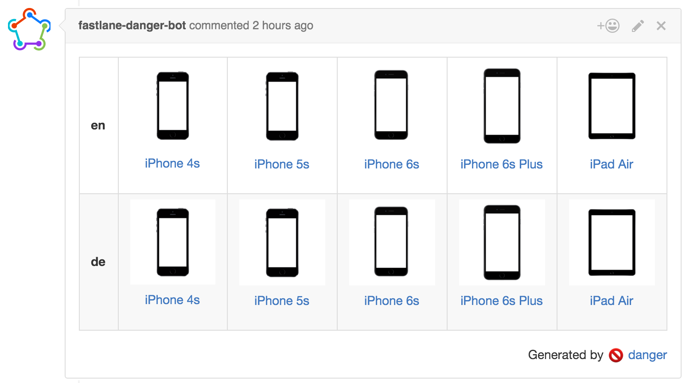

# fastlane danger Device Grid

Follow this guide to get a grid of devices every time you submit a pull request. The apps will be uploaded to [appetize.io](https://appetize.io/) so you can stream and try them right in your browser.

No more manually installing and testing your app just to review a PR.



## Requirements

- [fastlane](https://fastlane.tools)
- [danger](https://github.com/danger/danger)
- [appetize.io](https://appetize.io/) account
- A Continuous Integration system

## Getting started

### Install fastlane and danger

Create a `Gemfile` in your project's directory with the following content

```ruby
gem "fastlane"
gem "danger"
```

and run

```
bundle install
```

### Setup `fastlane`

Skip this step if you're already using `fastlane` (which you should)

```
fastlane init
```

### Setup `danger`

```
danger init
```

Follow the `danger` guide to authenticate with GitHub

### Configure fastlnae

Edit `fastlane/Fastfile`. Feel free to remove the auto-generated lanes. Add the following lane:

```ruby
desc "Generate a device grid, that will be posted to GitHub"
lane :device_grid do
  import_from_git(url: "https://github.com/fastlane/fastlane",
                  path: "fastlane/lib/fastlane/actions/device_grid/DeviceGridFastfile")

  generate_device_grid(
    xcodebuild: {
      workspace: "YourApp.xcworkspace",
      scheme: "YourScheme"
    }
  )
end
```

Make sure to fill in your actual workspace and scheme, or replace those 2 parameters with `project: "YourApp.xcworkspace"`

### Configure `danger`

Edit `Dangerfile` and replace the content with

```ruby
puts "Running fastlane to generate and upload an ipa file..."
puts `fastlane device_grid` # this will generate and upload your ipa file

import "https://raw.githubusercontent.com/fastlane/fastlane/master/fastlane/lib/fastlane/actions/device_grid/device_grid.rb"

device_grid(
  languages: ["en-US", "de-DE"],
  devices: ["iphone5s", "iphone6splus", "ipadair"]
)
```

### Try it

Push everything to GitHub in its own branch and create a `[WIP]` PR to trigger your CI system. 
